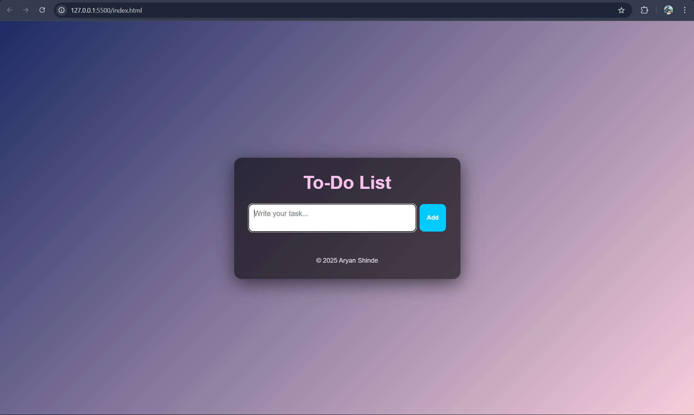
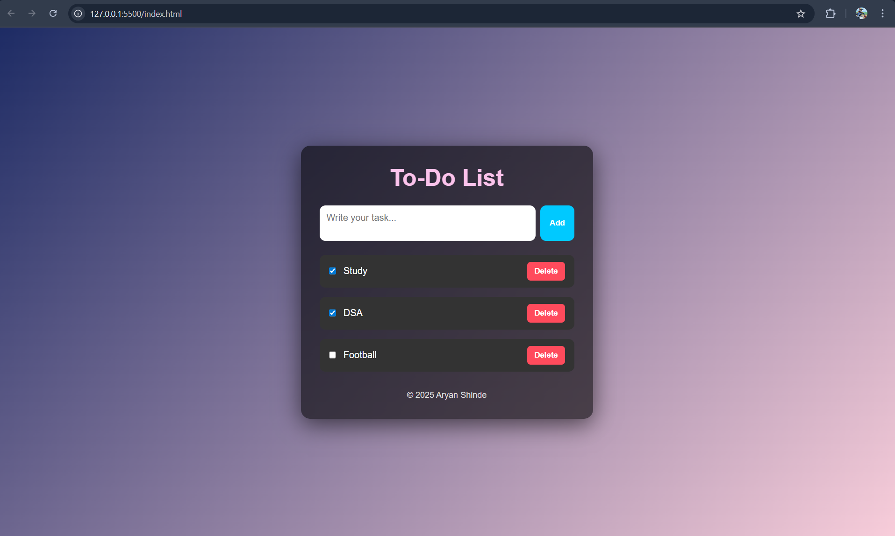
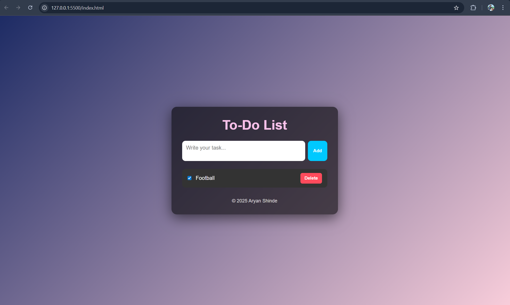

# 📝 To-Do List Web App

A beautifully styled and functional To-Do List built using **HTML**, **CSS**, and **JavaScript**. Add, check off, and delete tasks easily with a responsive user interface.

---

## 🌟 Features

- ✅ Add tasks on the fly
- ✔️ Mark tasks as complete
- 🗑️ Delete individual tasks
- 💅 Modern, responsive UI
- ⚡ Smooth user interactions

---

## 🚀 Live Demo

👉 [View Live on GitHub Pages](https://experio2705.github.io/News-Mania/)  
*(Replace this link with your actual deployed link if different)*

---

## 📸 Screenshot

---

